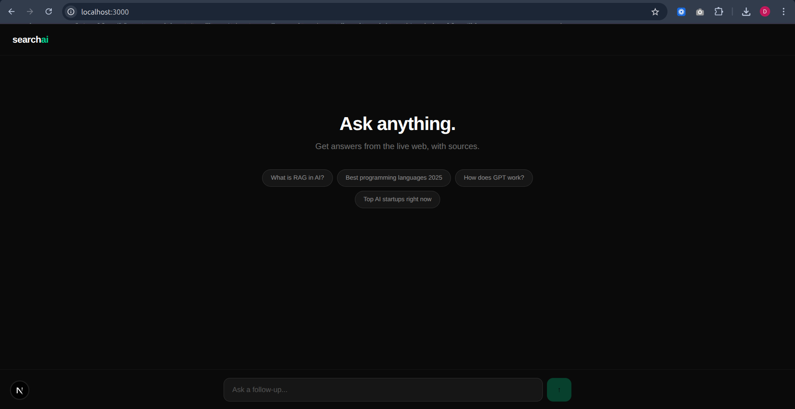
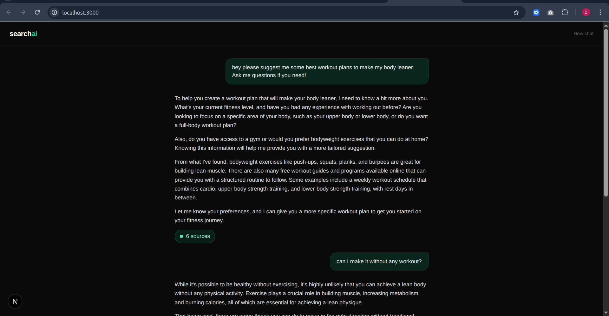
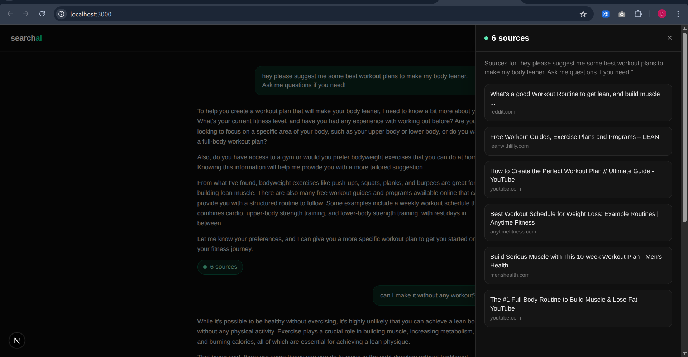

# SearchAI 🔍

A Perplexity-inspired AI search assistant that answers questions using live web results. Ask anything, get sourced answers, and continue the conversation with full memory.


## Features

- 🌐 **Live web search** powered by Tavily API
- 🤖 **Conversational AI** with full chat memory (Groq + LLaMA 3.3 70B)
- 📎 **Cited sources** shown with every answer
- ⚡ **Streaming responses** — answers appear token by token
- 💬 **Follow-up questions** — the AI remembers the full conversation

## Screenshots

### Home


### Search in Action


### Conversation sources/links


## Tech Stack

- **Framework** — Next.js 16.2.4 (App Router)
- **LLM** — Groq API (LLaMA 3.3 70B)
- **Web Search** — Tavily API
- **Styling** — Tailwind CSS

## Getting Started

### 1. Clone the repo

```bash
git clone https://github.com/yourusername/searchai.git
cd searchai
```

### 2. Install dependencies

```bash
npm install
```

### 3. Set up environment variables

Create a `.env.local` file in the root:

```env
TAVILY_API_KEY=your_tavily_key_here
GROQ_API_KEY=your_groq_key_here
```

- Get your Tavily key → [tavily.com](https://tavily.com)
- Get your Groq key → [console.groq.com](https://console.groq.com)

### 4. Run the development server

```bash
npm run dev
```

Open [http://localhost:3000](http://localhost:3000) in your browser.

## How It Works

1. User types a question
2. **Tavily** searches the live web and returns top 6 results
3. Results are injected as context into the LLM prompt
4. **Groq** streams the answer back token by token
5. Sources are displayed below the answer
6. Full conversation history is sent with each request so the AI remembers context

